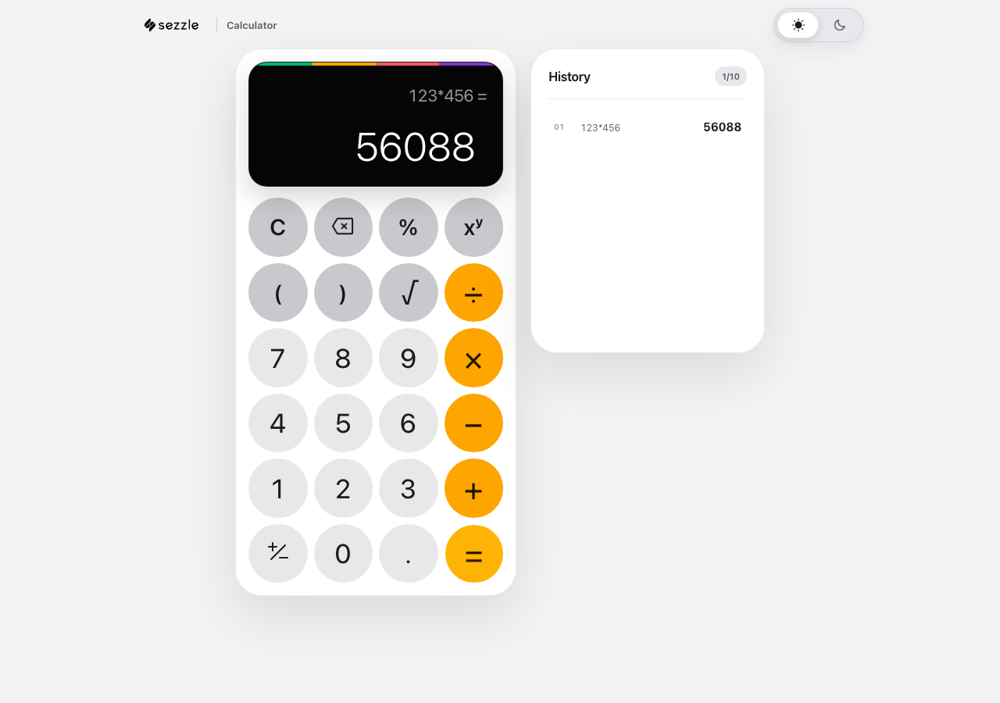
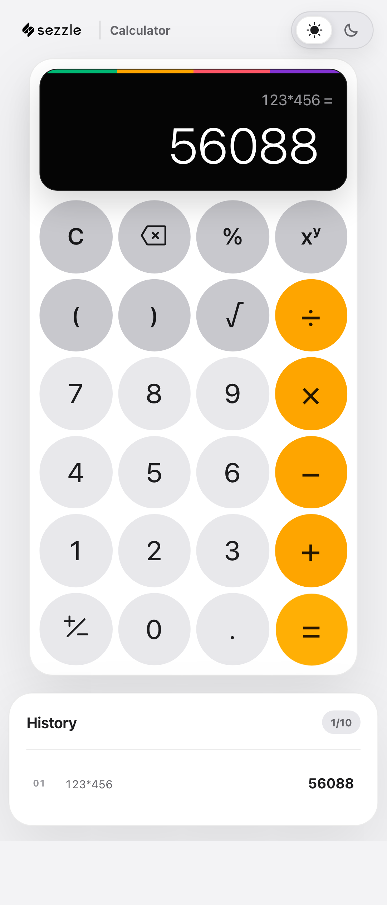

# Sezzle Calculator

[](https://github.com/MuhammedTBulut/calculator/actions/workflows/ci.yml)

A full-stack calculator built for the Sezzle take-home assignment. The Go
service evaluates named operations and infix expressions; the React +
TypeScript client provides an accessible, responsive calculator UI with
keyboard support, light/dark themes, history, and clear error states.

<p align="center">
  
  
</p>

Calculator input follows familiar handheld behavior: an empty operation starts
from zero, the latest pending operator wins, decimals are normalized, digits
start a fresh calculation after a result, operators continue from that result,
and repeated equals reapplies the last binary operation.

**[docs/visual-evidence.md](docs/visual-evidence.md)** shows the responsive
layout at five viewport sizes, both themes, and every error state — captured
by tests that assert each state before photographing it, so the images cannot
drift from the code.

## Quick start with Docker

Prerequisite: Docker with Compose v2.

```sh
docker compose up --build
```

Open <http://localhost:3000>. nginx serves the frontend and proxies `/api/*`
to the private backend container. Stop the stack with `docker compose down`.

## Local development

Prerequisites:

- Go 1.26 or newer
- Node.js 22 or newer and npm

Install frontend dependencies once:

```sh
cd frontend
npm ci
```

Run the two processes in separate terminals:

```sh
# Terminal 1
make run-backend       # http://localhost:8080

# Terminal 2
make run-frontend      # http://localhost:5173
```

Vite proxies `/api` to the backend, so local browser requests remain
same-origin. To call the Go service from a different frontend origin, set
`CORS_ORIGIN` before starting it.

## API

The full machine-readable contract is in
[`docs/openapi.yaml`](docs/openapi.yaml). Every error uses the same envelope:

```json
{
  "error": {
    "code": "DIVISION_BY_ZERO",
    "message": "division by zero"
  }
}
```

### Evaluate an expression

```sh
curl -i http://localhost:8080/api/v1/calculate \
  -H 'Content-Type: application/json' \
  -d '{"expression":"(2+3)*sqrt(16)"}'
```

```json
{"result":20}
```

### Execute a named operation

```sh
curl -i http://localhost:8080/api/v1/calculate \
  -H 'Content-Type: application/json' \
  -d '{"operation":"divide","operands":[10,2]}'
```

```json
{"result":5}
```

### Discover operations and check health

```sh
curl http://localhost:8080/api/v1/operations
curl http://localhost:8080/health
```

| Endpoint | Purpose | Success |
| --- | --- | --- |
| `POST /api/v1/calculate` | Evaluate an expression or named operation | `200` |
| `GET /api/v1/operations` | List supported operations and symbols | `200` |
| `GET /health` | Liveness probe | `200` |

Malformed JSON and invalid request shapes return `400`; bodies above 1 KiB
return `413`; domain errors such as division by zero return `422`; an exhausted
calculation rate limit returns `429` with `Retry-After` in whole seconds.

## Rate limiting

`POST /api/v1/calculate` uses a concurrency-safe, in-memory token bucket per
client IP. The default allows a sustained 60 requests per minute with a burst
of 20. This is intentionally generous for an interactive calculator while
protecting the public compute endpoint from accidental loops and basic abuse.
`/health` and operation discovery are exempt.

| Environment variable | Default | Meaning |
| --- | ---: | --- |
| `RATE_LIMIT_PER_MINUTE` | `60` | Sustained calculation rate per client |
| `RATE_LIMIT_BURST` | `20` | Maximum immediately available tokens |
| `TRUST_PROXY` | `false` | Use a proxy-overwritten `X-Real-IP` as the client key |
| `PORT` | `8080` | Backend listen port |
| `CORS_ORIGIN` | `http://localhost:5173` | Exact allowed browser origin |

Set `TRUST_PROXY=true` only when the backend is unreachable except through a
trusted proxy that overwrites `X-Real-IP`. The supplied Compose topology does
this. Buckets are process-local by design; a horizontally scaled deployment
should enforce the shared quota at its gateway or replace this store with a
distributed one such as Redis.

## Design decisions

### Backend

- **Hexagonal-lite dependency direction:** `internal/api → internal/parser →
  internal/calculator`. HTTP and JSON never enter the domain packages.
- **Standard library HTTP:** `http.ServeMux` and explicit middleware keep the
  service small and make dependencies visible in `cmd/server/main.go`.
- **Open/Closed operations registry:** adding an operation means implementing
  the small `Operation` interface and registering it at the composition root.
- **Shunting-yard parser:** precedence, right-associative exponentiation,
  unary minus, parentheses, percentages, and `sqrt` are handled without
  evaluating arbitrary code.
- **Transport safety:** strict JSON decoding, a 1 KiB body cap, server
  timeouts, panic recovery, exact-origin CORS, request IDs, structured logs,
  graceful shutdown, and rate limiting are adapter concerns.
- **`float64` arithmetic:** appropriate for a general calculator exercise;
  financial currency calculations would require a decimal representation and
  explicit rounding rules.

### Frontend

- **API boundary:** components never call `fetch`; `CalculatorApi` is injected
  into `useCalculator`, so tests use a deterministic fake.
- **Single state owner:** calculation behavior lives in `useCalculator` while
  UI components remain presentational.
- **Responsive by construction:** the display and keypad share size tokens,
  switch layouts for constrained aspect ratios, and scale long readouts to
  remain visible without clipping.
- **Accessible interaction:** semantic buttons, keyboard parity, focus states,
  reduced-motion support, input validation, and stable error-code mapping.

## Testing and quality checks

Current measured coverage (`2026-07-22`): backend statements **88.4%**;
frontend statements **93.14%**, branches **87.32%**, functions **96%**, and
lines **93.19%**. The commands below regenerate the reports.

Run the same core checks used by CI:

```sh
make lint
make test
make cover
make e2e             # after installing Chromium once; see below
```

Or run each layer directly:

```sh
cd backend
go test -race -coverprofile=coverage.out ./...
go tool cover -func=coverage.out

cd ../frontend
npm run lint
npm run test
npm run coverage
npm run build
npx playwright install chromium  # first local run only
npm run test:e2e
```

Backend tests cover operations, parser properties and fuzz regressions, HTTP
handlers, the OpenAPI response contract, middleware, rate-limit isolation,
and composition-root wiring. Frontend tests cover the API adapter, calculator
state, keyboard behavior, responsive display formatting, errors, and primary
user flows. Playwright runs the application against the real Go backend in
desktop and mobile Chromium, checks viewport containment, and scans both
themes for automatically detectable WCAG A/AA violations. CI publishes the
backend coverage summary and Playwright HTML report as artifacts on every push
and pull request.

## Repository layout

```text
backend/
  cmd/server/          composition root and process lifecycle
  internal/api/        REST adapter and middleware
  internal/parser/     expression tokenizer and evaluator
  internal/calculator/ operation domain
frontend/
  src/api/             testable backend client boundary
  src/hooks/           calculator and interaction state
  src/components/      presentational React components
  e2e/                 real-browser integration and accessibility tests
docs/
  openapi.yaml         API contract
  prompts.md           AI prompts used during development
  reviews.md           design-review decisions
  screenshots/         current desktop and mobile product captures
```

## AI tooling disclosure

The prompts used to scaffold, implement, review, and refine the project are
included in [`docs/prompts.md`](docs/prompts.md). Design-review outcomes and
accepted/rejected trade-offs are recorded in
[`docs/reviews.md`](docs/reviews.md).
