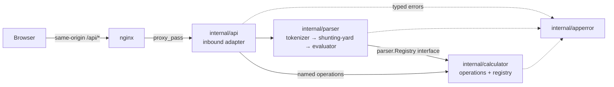
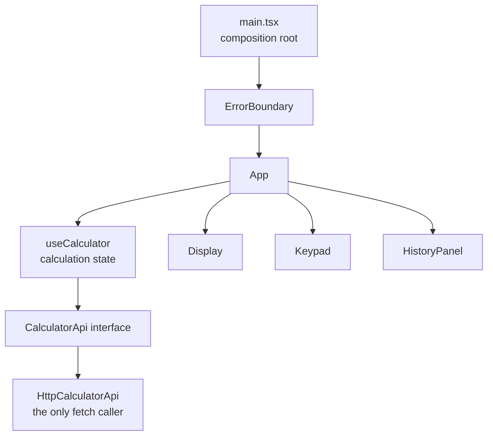

# Sezzle Calculator

[](https://github.com/MuhammedTBulut/calculator/actions/workflows/ci.yml)

A full-stack calculator built for the Sezzle take-home assignment. The Go
service evaluates named operations and infix expressions; the React +
TypeScript client provides an accessible, responsive calculator UI with
keyboard support, light/dark themes, history, and clear error states.

<p align="center">
  
  
</p>

Calculator input follows familiar handheld behavior: an empty operation starts
from zero, the latest pending operator wins, decimals are normalized, digits
start a fresh calculation after a result, operators continue from that result,
and repeated equals reapplies the last binary operation.

**[docs/visual-evidence.md](docs/visual-evidence.md)** shows the responsive
layout at five viewport sizes, both themes, and every error state — captured
by tests that assert each state before photographing it, so the images cannot
drift from the code.

## Quick start with Docker

Prerequisite: Docker with Compose v2.

```sh
docker compose up --build
```

Open <http://localhost:3000>. nginx serves the frontend and proxies `/api/*`
to the private backend container. Stop the stack with `docker compose down`.

## Local development

Prerequisites:

- Go 1.26 or newer
- Node.js 22 or newer and npm

Install frontend dependencies once:

```sh
cd frontend
npm ci
```

Run the two processes in separate terminals:

```sh
# Terminal 1
make run-backend       # http://localhost:8080

# Terminal 2
make run-frontend      # http://localhost:5173
```

Vite proxies `/api` to the backend, so local browser requests remain
same-origin. To call the Go service from a different frontend origin, set
`CORS_ORIGIN` before starting it.

## API

The full machine-readable contract is in
[`docs/openapi.yaml`](docs/openapi.yaml). Every error uses the same envelope:

```json
{
  "error": {
    "code": "DIVISION_BY_ZERO",
    "message": "division by zero"
  }
}
```

### Evaluate an expression

```sh
curl -i http://localhost:8080/api/v1/calculate \
  -H 'Content-Type: application/json' \
  -d '{"expression":"(2+3)*sqrt(16)"}'
```

```json
{"result":20}
```

### Execute a named operation

```sh
curl -i http://localhost:8080/api/v1/calculate \
  -H 'Content-Type: application/json' \
  -d '{"operation":"divide","operands":[10,2]}'
```

```json
{"result":5}
```

### Discover operations and check health

```sh
curl http://localhost:8080/api/v1/operations
curl http://localhost:8080/health
```

| Endpoint | Purpose | Success |
| --- | --- | --- |
| `POST /api/v1/calculate` | Evaluate an expression or named operation | `200` |
| `GET /api/v1/operations` | List supported operations and symbols | `200` |
| `GET /health` | Liveness probe | `200` |

Malformed JSON and invalid request shapes return `400`; bodies above 1 KiB
return `413`; domain errors such as division by zero return `422`; an exhausted
calculation rate limit returns `429` with `Retry-After` in whole seconds.

## Rate limiting

`POST /api/v1/calculate` uses a concurrency-safe, in-memory token bucket per
client IP. The default allows a sustained 60 requests per minute with a burst
of 20. This is intentionally generous for an interactive calculator while
protecting the public compute endpoint from accidental loops and basic abuse.
`/health` and operation discovery are exempt.

| Environment variable | Default | Meaning |
| --- | ---: | --- |
| `RATE_LIMIT_PER_MINUTE` | `60` | Sustained calculation rate per client |
| `RATE_LIMIT_BURST` | `20` | Maximum immediately available tokens |
| `TRUST_PROXY` | `false` | Use a proxy-overwritten `X-Real-IP` as the client key |
| `PORT` | `8080` | Backend listen port |
| `CORS_ORIGIN` | `http://localhost:5173` | Exact allowed browser origin |

Set `TRUST_PROXY=true` only when the backend is unreachable except through a
trusted proxy that overwrites `X-Real-IP`. The supplied Compose topology does
this. Buckets are process-local by design; a horizontally scaled deployment
should enforce the shared quota at its gateway or replace this store with a
distributed one such as Redis.

## Architecture

A request travels inward through one adapter and never travels back out:



Dependencies point inward: `internal/api` may name domain types, while
`internal/calculator` and `internal/parser` never reference the adapter,
`net/http`, or `encoding/json`. That is not a comment — it is asserted by
`TestDomainImportBoundaries` in
[`backend/internal/architecture_test.go`](backend/internal/architecture_test.go),
which fails the build when violated.

The frontend is layered the same way, with one seam to the network:



## Design decisions

### Backend

- **Hexagonal-lite dependency direction:** transport depends on the domain,
  never the reverse (`internal/api` → `internal/parser` → `internal/calculator`,
  with `internal/apperror` depended on by all three). HTTP and JSON never
  enter the domain packages.
- **Standard library HTTP:** `http.ServeMux` and explicit middleware keep the
  service small and make dependencies visible in `cmd/server/main.go`.
- **Open/Closed operations registry:** adding an operation means implementing
  the small `Operation` interface and registering it at the composition root.
- **Shunting-yard parser:** precedence, right-associative exponentiation,
  unary minus, parentheses, percentages, and `sqrt` are handled without
  evaluating arbitrary code.
- **Transport safety:** strict JSON decoding, a 1 KiB body cap, server
  timeouts, panic recovery, exact-origin CORS, request IDs, structured logs,
  graceful shutdown, and rate limiting are adapter concerns.
- **`float64` arithmetic:** appropriate for a general calculator exercise;
  financial currency calculations would require a decimal representation and
  explicit rounding rules.

### Frontend

- **API boundary:** components never call `fetch`; `CalculatorApi` is injected
  into `useCalculator`, so tests use a deterministic fake.
- **Single state owner for calculation:** every calculation rule — buffer,
  submission, history, errors, retry — lives in `useCalculator`. Components
  own only view-local concerns (`Display` measures its own width to decide
  scientific notation; `Key` owns its press animation), and theme and key
  feedback live in dedicated hooks.
- **Responsive by construction:** the display and keypad share size tokens,
  switch layouts for constrained aspect ratios, and scale long readouts to
  remain visible without clipping.
- **Accessible interaction:** semantic buttons, keyboard parity, focus states,
  reduced-motion support, input validation, and stable error-code mapping.

### SOLID, mapped to this repository

Each row names a file, not an intention.

| Principle | Where | Why it holds |
| --- | --- | --- |
| Single responsibility | `internal/parser/{tokenizer,shunting_yard,evaluator}.go` | Lexing, grammar, and evaluation fail independently and are tested independently; a precedence bug cannot be a tokenizer bug. |
| Open/closed | `calculator.NewRegistry` (`internal/calculator/registry.go:37`) | A new operation is a new file plus one argument at the composition root; no existing domain file changes. Expression *syntax* for it would additionally need a `binaryOps`/`functions` entry in the parser. |
| Liskov substitution | `Registry.Execute` (`internal/calculator/registry.go:75`) | The registry defensively enforces arity, finite operands, and finite results for *every* `Operation`, so a substituted implementation cannot weaken the contract. `TestExecuteEnforcesInvariantsOnNonConformingOperations` proves it with a deliberately misbehaving operation. |
| Interface segregation | `api.Calculator`, `api.Evaluator` (`internal/api/handler.go`), `parser.Registry` (`internal/parser/evaluator.go`) | Consumer-side interfaces: each names only the methods its consumer calls, so the adapter cannot reach into parser internals. |
| Dependency inversion | `parser.NewEvaluator(Registry)` + `buildHandler` (`cmd/server/main.go`) | The parser depends on an interface it declares itself and never imports concrete operations; all wiring is manual and in one function. |

### Other applied principles

| Principle | Evidence |
| --- | --- |
| Ports and adapters [Cockburn 2005] | One inbound adapter; boundary enforced by `TestDomainImportBoundaries`. |
| Parse, don't validate [King 2019] | The adapter parses the wire format once — `json.RawMessage` makes field *presence* observable, so `null` is rejected rather than read as absent — and hands typed primitives inward (`internal/api/handler.go`). Note this is strict boundary parsing, not a domain sum type: validity is still checked by combination rather than made unrepresentable. |
| Testing pyramid [Fowler] | Many unit and table tests, a contract layer over `docs/openapi.yaml`, and a deliberately small browser suite (`frontend/e2e/`). |
| Twelve-factor III, IX, XI | Config from the environment (`loadConfig`), graceful shutdown via `signal.NotifyContext`, logs as an event stream on stdout via `log/slog`. |
| Errors as values [Go blog] | Typed sentinels in `internal/apperror` matched with `errors.Is`/`errors.As`, wrapped with `%w` and context at every layer. |
| Input limits, CORS, no error leakage [OWASP REST] | 1 KiB `MaxBytesReader` → 413, exact-origin CORS, and redacted 500s whose detail goes to the log with the request ID. |

## Consciously omitted

| Omitted | Why |
| --- | --- |
| Database | Nothing outlives a request. History is session state in the browser; persisting it would add a store, migrations, and a backup story to no benefit. |
| Authentication | The endpoint exposes arithmetic, not data. Auth would add a token lifecycle without protecting anything; abuse is handled by rate limiting instead. |
| State-management library | One hook owns the calculation state. Redux or Zustand would add indirection with nothing to coordinate. |
| DI framework | Wiring is nine lines in `buildHandler`. A container would move that into runtime reflection and hide the graph. |
| Metrics and tracing | There is one service and one hop; request IDs plus structured logs answer "what happened to this request". Tracing pays off across process boundaries this system does not have. |
| Microservice split | See [ADR 004](docs/adr/004-single-service-not-microservices.md) — the boundaries are enforced in code without paying distribution costs. |

## Testing and quality checks

Measured on 2026-07-22 with the commands below, on the delivered code:
backend statements **88.4%** (`internal/calculator` 100%, `internal/apperror`
100%, `internal/parser` 94.2%, `internal/api` 92.9%, `cmd/server` 51.3%);
frontend statements **94.14%**, branches **88.74%**, functions **96.34%**,
lines **94.18%**. CI prints the backend figure in its job summary on every
push, so these numbers are reproducible rather than asserted.

Run the same core checks used by CI:

```sh
make lint
make test
make cover
make e2e             # after installing Chromium once; see below
```

Or run each layer directly:

```sh
cd backend
go test -race -coverprofile=coverage.out ./...
go tool cover -func=coverage.out

cd ../frontend
npm run lint
npm run test
npm run coverage
npm run build
npx playwright install chromium  # first local run only
npm run test:e2e
```

Backend tests cover operations, parser properties and fuzz regressions, HTTP
handlers, the OpenAPI response contract, middleware, rate-limit isolation,
and composition-root wiring. Frontend tests cover the API adapter, calculator
state, keyboard behavior, responsive display formatting, errors, and primary
user flows. Playwright runs the application against the real Go backend in
desktop and mobile Chromium, checks viewport containment, and scans both
themes for automatically detectable WCAG A/AA violations. CI publishes the
backend coverage summary and Playwright HTML report as artifacts on every push
and pull request.

Two scope notes, so the guarantees are not read as wider than they are:

- **Contract validation** covers endpoint responses recorded through the
  helper in `internal/api/contract_test.go`, which rejects statuses the spec
  does not document. `OPTIONS` preflights, unknown-route 404s, wrong-method
  405s, isolated middleware unit tests, and composition-root tests are outside
  that path; 404/405 behaviour is specified as prose policy in
  `docs/openapi.yaml` and asserted directly in tests.
- **Fuzzing** shows panic freedom, finite results, and typed failures for the
  inputs explored — a 60-second campaign of ~14.5M executions plus a committed
  228-input regression corpus under `internal/parser/testdata/`, replayed as
  ordinary tests on every run. That is strong evidence, not a proof for all
  possible inputs.

## Performance

`BenchmarkEvaluate` measures one full evaluation of `(2+3)*sqrt(16)-4^2` —
tokenize, convert to RPN, and execute every step through the registry:

```text
goos: darwin  goarch: arm64  cpu: Apple M5
BenchmarkEvaluate-10    1312210    918.8 ns/op    3000 B/op    22 allocs/op
BenchmarkEvaluate-10    1282244    928.0 ns/op    3000 B/op    22 allocs/op
BenchmarkEvaluate-10    1324366    903.0 ns/op    3000 B/op    22 allocs/op
```

Reproduce with:

```sh
cd backend && go test -bench=BenchmarkEvaluate -benchmem -count=3 -run=XXX ./internal/parser/
```

The allocations are the token and RPN slices; no attempt was made to pool them
because a calculation is three orders of magnitude cheaper than the HTTP
round-trip that carries it.

## Future work

- **Decimal arithmetic** behind the existing `Operation` interface, for
  contexts where base-10 exactness matters ([ADR 002](docs/adr/002-float64-over-decimal.md)).
- **OCR or voice input**, which can reuse the parser boundary directly: any
  producer of an expression string already has a tested evaluator behind it.
- **Shared-store rate limiting** (Redis or gateway-level) to replace the
  per-process buckets when more than one replica runs.

## Repository layout

```text
backend/
  cmd/server/          composition root and process lifecycle
  internal/api/        REST adapter and middleware
  internal/parser/     expression tokenizer and evaluator
  internal/calculator/ operation domain
frontend/
  src/api/             testable backend client boundary
  src/hooks/           calculator and interaction state
  src/components/      presentational React components
  e2e/                 real-browser integration and accessibility tests
docs/
  adr/                 five architecture decision records
  openapi.yaml         API contract
  prompts.md           AI prompts used during development
  reviews.md           cross-model design-review log
  screenshots/         current desktop and mobile product captures
```

The architecture boundary itself is tested in
`backend/internal/architecture_test.go`.

## A 10-minute tour of this codebase

**Where the architecture boundary is enforced.**
[`backend/internal/architecture_test.go`](backend/internal/architecture_test.go)
— `TestDomainImportBoundaries` reads each domain package's production imports
with `go/build` and fails if it sees `net/http`, `encoding/json`, or
`internal/api`. `TestNothingDependsOnTheAdapter` pins the direction, and
`TestDomainCarriesNoJSONTags` catches a wire format leaking into domain types.

**The hardest edge cases, and what covers each.**

| Edge case | Covered by |
| --- | --- |
| `-3^2` is `-9`, but `(-3)^2` is `9` — unary minus binds looser than `^` | `TestToRPN` / `TestEvaluate` (`internal/parser`) |
| `0^-1` is a pole (`1/0`), not overflow | `TestExecute` "power of zero to negative integer" (`internal/calculator`) |
| A syntax error's position must survive multi-byte input | `TestTokenizeErrors`, `faultRange` tests (`frontend/src/lib/position.test.ts`) |
| `{"expression":"1+1","operation":null}` must be rejected, not read as absent | `TestCalculate` "null operation with expression" (`internal/api`) |
| `{...} }` is trailing garbage that `Decoder.More()` misses | `TestCalculate` "stray closing brace" |
| `1e309` is valid JSON but not a `float64` | `TestCalculate` "operand beyond float64 range" |
| An operation returning `NaN` with a nil error must not escape | `TestExecuteEnforcesInvariantsOnNonConformingOperations` |
| A rate-limited response must still carry CORS and request-ID headers | `TestBuildHandlerAppliesMiddleware` (`cmd/server`) |

**The journey of one error.** A division by zero starts as
[`ErrDivisionByZero`](backend/internal/apperror/errors.go) returned by
[`Divide.Apply`](backend/internal/calculator/divide.go), wrapped with `%w` and
context. If it happened inside an expression, the evaluator propagates it
unchanged rather than flattening it
([`evaluator.go`](backend/internal/parser/evaluator.go)). The adapter matches
it with `errors.Is` in
[`mapDomainError`](backend/internal/api/errors.go) and emits
`422 {"error":{"code":"DIVISION_BY_ZERO", …}}` with a canonical message — the
wrapped internal context never reaches the client. The browser client
normalizes that envelope into a `CalcResult`
([`client.ts`](frontend/src/api/client.ts)), and `useCalculator` renders text
from the **code**, never the server's string, so the user reads "Can't divide
by zero". For a syntax error the same path additionally carries `position`,
which
[`faultRange`](frontend/src/lib/position.ts) converts from a UTF-8 byte offset
to a UTF-16 range so the failing character is underlined exactly.

**Three commits that show the process.**

- `8e0a66a` — the HTTP adapter after cross-model review: `null` fields that
  slipped past the request-shape check, `Decoder.More()` accepting `{...} }`,
  and `1e309` misfiled as malformed JSON.
- `a19d8ab` — accessibility fixes the review caught: Enter was being stolen
  from focused buttons (APG), and printable-character shortcuts fired
  page-wide (WCAG 2.1.4).
- `4c5296f` — writing coverage badges prompted measuring them; the frontend
  was at 69.5%, not the claimed 90%, with the API client and error boundary at
  literally 0%. The commit closes the gap and the badges were rewritten to the
  measured numbers.

## How AI was used

The architecture was decided before any code was generated: the hexagonal-lite
split, the error taxonomy, the status-code discipline, and the scope
boundaries are recorded as prompts in
[`docs/prompts.md`](docs/prompts.md) and as rules in `CLAUDE.md`, and the
model was held to them. Claude Code generated the implementation, the
table-driven test bodies, the fuzz harness, and the documentation. Every
stage was then reviewed by a second model — OpenAI Codex, acting as an
independent senior reviewer — at five checkpoints, with each finding either
addressed or rebutted in writing; the log is
[`docs/reviews.md`](docs/reviews.md). That review caught defects a single
model missed: for example, `Registry.Execute` delegated straight to
`Apply`, so any non-conforming `Operation` could bypass the arity and
finiteness invariants the registry advertised — the fix moved enforcement into
`Execute` and added a deliberately misbehaving test operation to prove it. The
review also rejected a claim, not just code: "every recorded response is
validated against the OpenAPI contract" was false, because several tests
bypass the validating helper, so this README states the narrower scope that is
actually true. Judgement calls stayed human: what to build, what to leave out,
and which review findings to rebut.

## References

- Cockburn, A. — *Hexagonal Architecture (Ports & Adapters)*, 2005.
  <https://alistair.cockburn.us/hexagonal-architecture/>
- Fowler, M. — *MonolithFirst*, 2015.
  <https://martinfowler.com/bliki/MonolithFirst.html>
- Fowler, M. — *Microservice Trade-Offs*, 2015.
  <https://martinfowler.com/articles/microservice-trade-offs.html>
- Fowler, M. — *TestPyramid*.
  <https://martinfowler.com/bliki/TestPyramid.html>
- Dijkstra, E. W. — *Algol 60 translation* (shunting-yard), Mathematisch
  Centrum report MR 34/61, 1961. Cited inline in
  `internal/parser/shunting_yard.go`.
- King, A. — *Parse, don't validate*, 2019.
  <https://lexi-lambda.github.io/blog/2019/11/05/parse-don-t-validate/>
- Metz, S. — *The Wrong Abstraction*, 2016.
  <https://sandimetz.com/blog/2016/1/20/the-wrong-abstraction>
- Goldberg, D. — *What Every Computer Scientist Should Know About
  Floating-Point Arithmetic*, ACM Computing Surveys 23(1), 1991.
- IEEE 754-2019 — floating-point standard (NaN/±Inf semantics used in operand
  and result validation).
- *The Twelve-Factor App* — factors III, IX, XI. <https://12factor.net>
- Go team — *Error Handling and Go*, 2011.
  <https://go.dev/blog/error-handling-and-go>
- OWASP — *REST Security Cheat Sheet* (request size limits → 413, CORS
  specificity, no technical detail in error responses).
  <https://cheatsheetseries.owasp.org/cheatsheets/REST_Security_Cheat_Sheet.html>
- W3C — *WCAG 2.1*: 1.4.3 Contrast (Minimum) 4.5:1, 1.4.11 Non-text Contrast
  3:1, 2.1.4 Character Key Shortcuts. <https://www.w3.org/TR/WCAG21/>
- RFC 9110 — *HTTP Semantics*, 2022: §15.5.1 (400), §15.5.6 (405 — the
  `Allow` header is mandatory), §15.5.14 (413 Content Too Large).
  <https://www.rfc-editor.org/rfc/rfc9110.html>
- Testing Library — *Guiding Principles*. <https://testing-library.com/docs/guiding-principles/>

Every URL above was fetched and confirmed to be the cited source before
publication; the offline entries (Dijkstra MR 34/61, Goldberg 1991,
IEEE 754-2019) are cited for bibliographic reference only.
