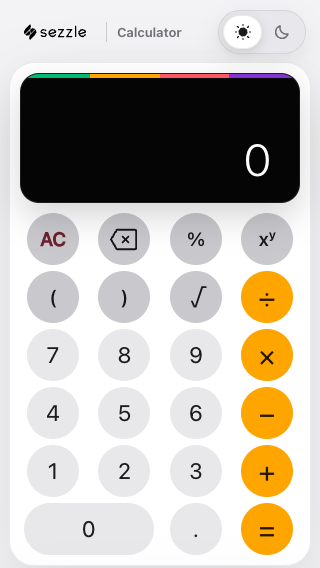
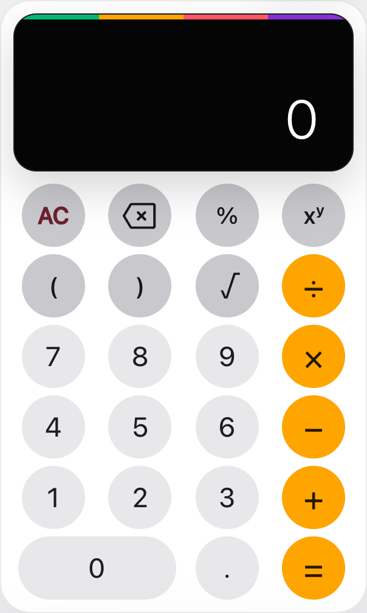

# Calculator Key Alignment Audit

Date: 2026-07-22

## Audit scope

- Surface: calculator keypad at 320 × 568 CSS px, light theme.
- Goal: determine whether number and icon/operator content uses the same centering model.
- Capture tool: the active Chrome preview, device scale factor 1.
- Saved Product Design context: not available; the live implementation was used as the source of truth.

## Step 1 — Idle keypad

Health: healthy, with a minor optical-centering opportunity.

### Confirmed strengths

- Every key uses CSS Grid with `place-items: center`.
- The Phosphor backspace SVG is geometrically centered with a measured center delta of 0 px on both axes.
- Text-based controls `xʸ` and `√` differ from the button center by approximately 0.1 px.
- Arithmetic glyph line boxes differ from the button center by 0 px horizontally and 0.41 px vertically, which is normal subpixel font rasterization.
- No runtime exception occurred during capture.

### Finding

- [P3] The user's perception is valid even though the boxes are technically centered. `xʸ`, `√`, the outlined backspace shape, and mathematical operators have uneven visual mass. Numbers are more symmetrical, so they read as more centered.

### Recommendation

- Do not shift every icon globally; that would make the mathematically centered controls objectively off-center.
- If additional polish is desired, wrap only the visually top-heavy glyphs and apply small, component-specific optical corrections—generally no more than 0.5–1 px—then recheck at 1× and 2× density.

## Accessibility and evidence limits

- This is not an accessibility failure: button targets, labels, and geometric alignment are unaffected.
- Optical centering is partly subjective and can vary slightly with browser font rendering and display density. A physical-device check remains useful before release.
