# Visual evidence

Screenshots of the behaviour this project claims, captured from the running
application against the real Go backend.

**These images are produced by tests, not by hand.**
[`frontend/e2e/visual-evidence.spec.ts`](../frontend/e2e/visual-evidence.spec.ts)
asserts each state *before* photographing it, so a screenshot cannot drift
away from the code without the suite failing. Regenerate them with:

```sh
cd frontend && npx playwright test visual-evidence --project=desktop-chromium
```

No pixel comparison is performed. Font rasterisation differs between machines,
and a brittle image diff would train the team to ignore failures; the
assertions carry the correctness, the images carry the explanation.

## Responsive layout

The same calculation (`123 × 4 = 492`) at five viewport sizes. Each capture is
gated on three assertions: the document never scrolls horizontally, the
equals key stays inside the viewport, and keys remain at least 36 px tall so
they stay thumb-usable.

| Viewport | Evidence |
| --- | --- |
| 360 × 740 — small phone | 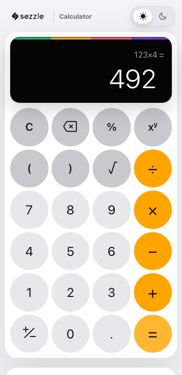 |
| 414 × 896 — large phone | 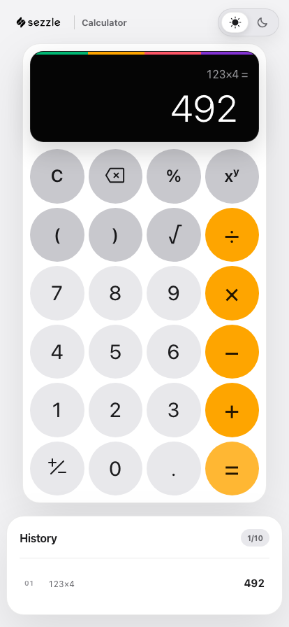 |
| 768 × 1024 — tablet | 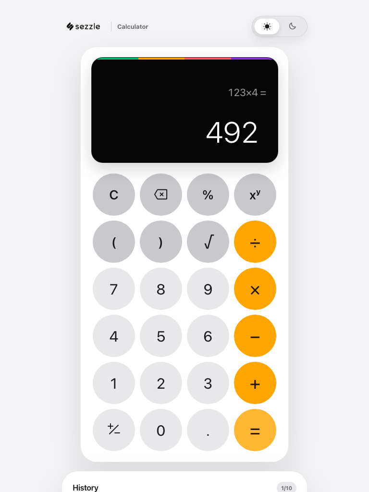 |
| 1024 × 600 — short landscape | 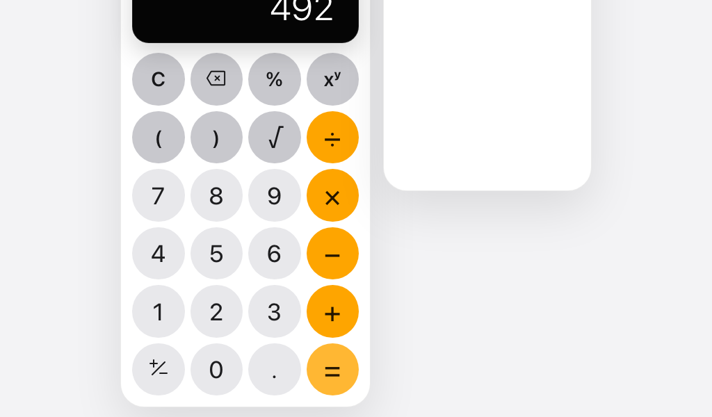 |
| 1280 × 832 — desktop |  |

At 1024 × 600 the viewport is wide but vertically constrained — the case that
breaks naive calculator layouts. The keypad reflows rather than clipping.

## Theming

Light and dark are both first-class: the toggle sets `data-theme` on the
document, and the axe scan in
[`calculator.spec.ts`](../frontend/e2e/calculator.spec.ts) runs against **both**
themes, so contrast is verified in each rather than assumed from one.

| State | Evidence |
| --- | --- |
| Light, desktop | 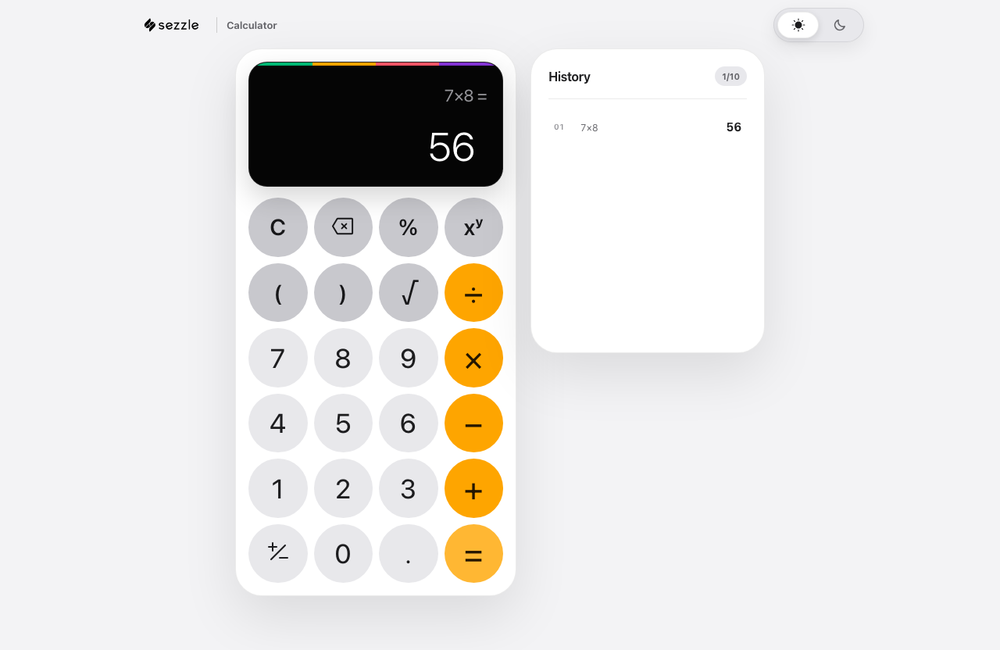 |
| Dark, desktop | 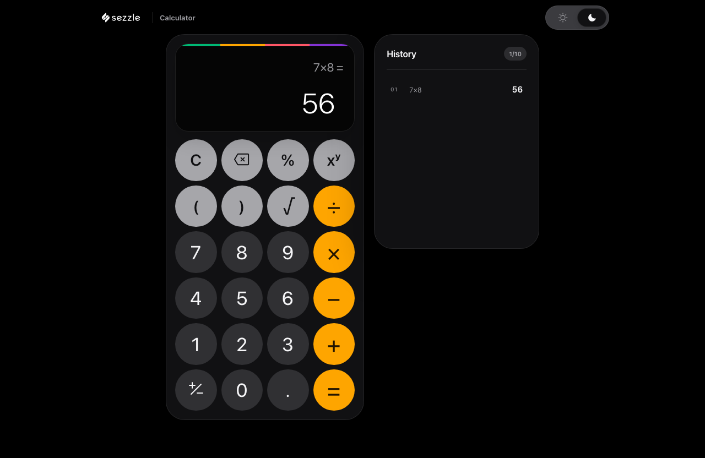 |
| Dark, small phone | 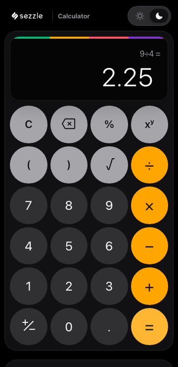 |

## Error handling

Every error below arrives as the API's machine-readable envelope; the UI
renders text from the **code**, never from the server's message string.

### Division by zero — a domain error, not a crash

`1 ÷ 0` returns `422 DIVISION_BY_ZERO`. The test asserts the friendly text is
shown **and** that the raw server string "division by zero" is absent, which
is what proves the code-to-message dictionary is actually in the path.


### Syntax error — the exact failing character

The signature detail. `(2+` is incomplete, so the backend reports a syntax
error with a byte position; the client converts that UTF-8 offset into a
UTF-16 range ([`lib/position.ts`](../frontend/src/lib/position.ts)) and marks
the spot. Because the fault is at end-of-input, it renders as an insertion
caret after the expression, and the alert names the character — "character 4"
— so the information is never carried by colour alone.

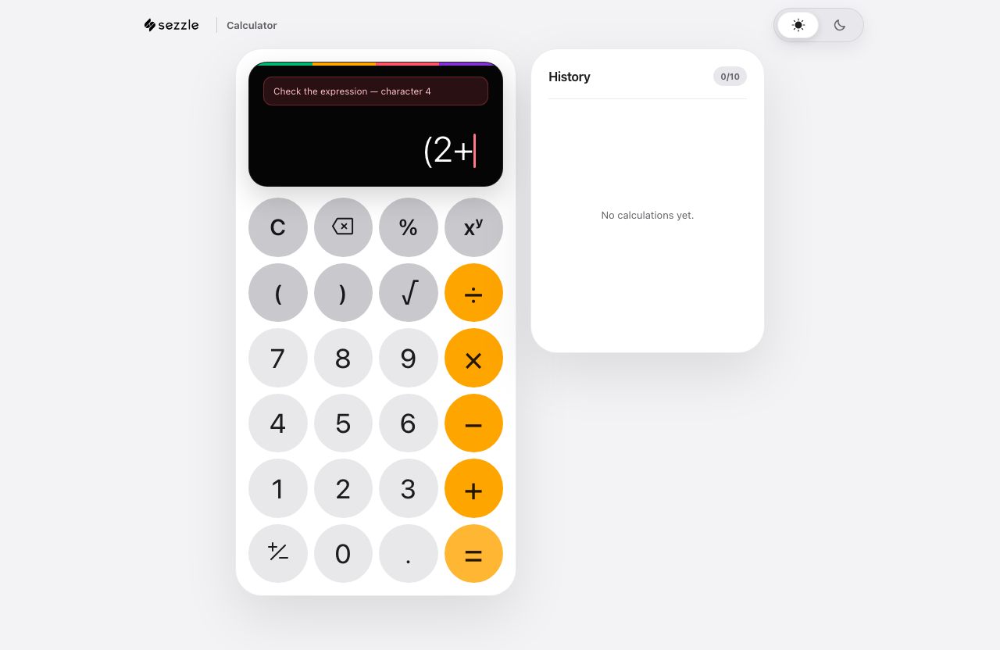

### Square root of a negative number

`√(4 − 9)` is rejected by the domain (`422 NEGATIVE_SQRT`) rather than
returning `NaN`. The registry refuses to emit non-finite values at all.

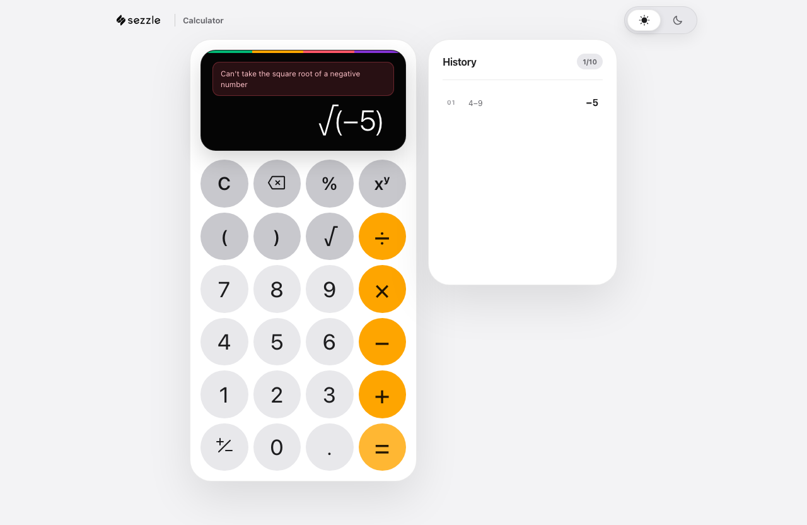

### Network failure — recoverable, with a retry

The request is aborted at the transport layer. The client normalizes this to
`NETWORK` (no exception crosses the API boundary) and the UI offers a retry
instead of a dead end.

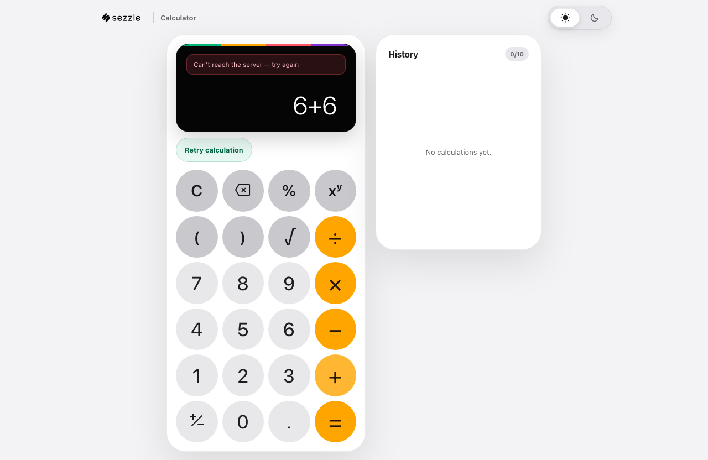

### Rate limiting — the wait is surfaced, not just the refusal

`429 RATE_LIMITED` carries `Retry-After: 7`, which the client parses and turns
into both the message and a live "Retry in 7s" countdown.

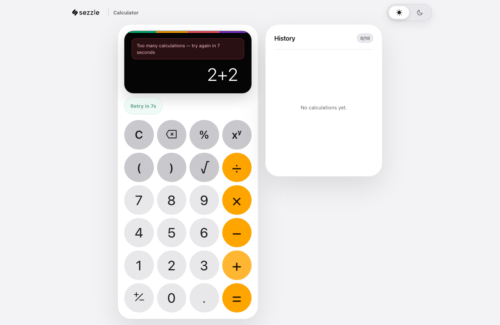

*Honest note:* this one response is served at the network layer rather than by
draining the real bucket — the backend is shared with every other test in the
suite, and exhausting it made unrelated tests fail. The body is byte-for-byte
what [`rate_limit.go`](../backend/internal/api/rate_limit.go) emits, and the
limiter's own behaviour (burst, refill, per-client isolation, `Retry-After`
rounding) is proven in Go by `TestRateLimiterAllowsBurstThenReturns429`. What
this image proves is the client's rendering of that contract.

## Interaction

### History

Ten most recent results, newest first, each recallable into the buffer.


### Keyboard operability

The test tabs until focus lands on a keypad key and asserts it did, so the
capture shows the focus ring where a keyboard user actually works. Full
keyboard entry is also available page-wide — scoped to when the calculator
owns focus, per WCAG 2.1.4.


